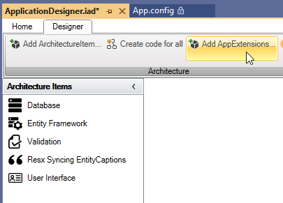

# Implementation

App Extensions enhance your application with the most common functionalities, eliminating the need for additional coding.

To add an App Extension, use the designer:

Click the "Add AppExtensions...". Select the extension you want to add and follow the instructions provided in the readme.txt that appears in Visual Studio.

AppExtensions typically consists of implementation code and a SQL-script.