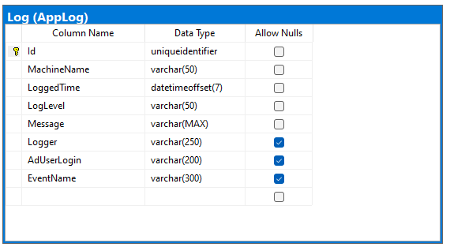
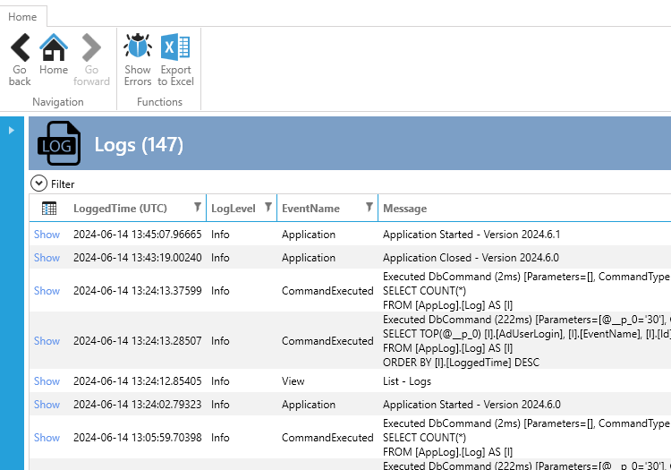
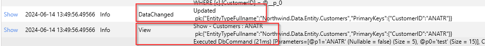
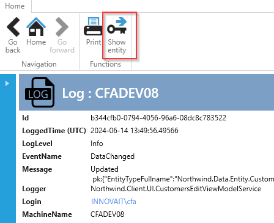

# Log Extension

The Log Extension provides two main features:

- Logging data to a database table in the SQL database.
- A user interface for viewing and searching the logs.

To implement the Log Extension, follow the instructions in the `readme.txt` that appears in Visual Studio after adding the extension.

## Implementation

The SQL-script creates 1 table and 1 stored procedure. The table is shown below. This table contains all the logs.



The stored procedure `[AppLog].[DeleteLog]` deletes log x number days back. It can be setup in SQL schedule job so the table only contains for example the last 300 days logs.

```sql
CREATE PROCEDURE [AppLog].[DeleteLog]
@numberOfDaysBack int
AS
BEGIN

declare @temp int = @numberOfDaysBack*-1

    DELETE [AppLog].[Log]
    WHERE  [LoggedTime] < DATEADD(day, @temp, getdate());
END
```


## User Interface

Once the Log Extension is implemented, you will have a user interface for viewing and searching logs.



The interface includes standard search functionality, similar to what you're already familiar with.

In the list, if you have an `EventName` such as "DataChanged" or "View" (and it is a show-view).



You can click on "Show" (on the left) to navigate to the show-view for that log. 

Notice the menu "Show entity." If you click this, you can see the entity that has been updated.



## Logging to Database

The Log Extension uses NLog for logging to the database.

The configuration of what to log is in the `nlog.config` file in the client project.

To log events in your application, use the `ILogger` interface, which is standard in .NET. [See Example here](../../tutorials/Logging/log_application.md)


[See more about NLog here](https://nlog-project.org/).
