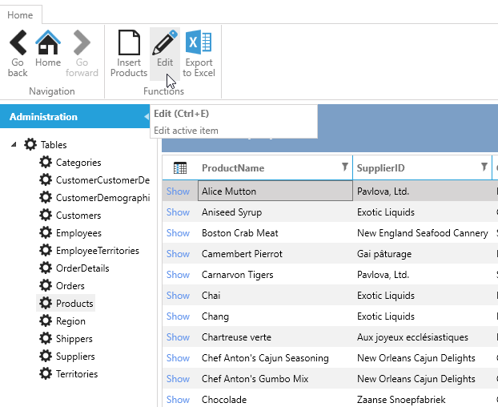
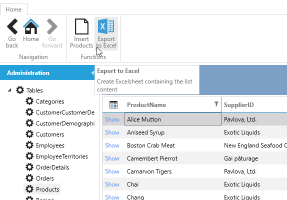
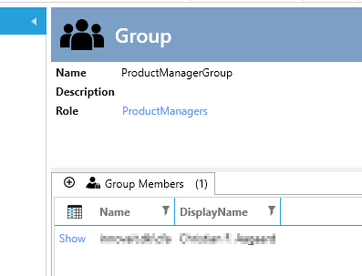
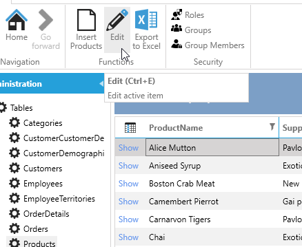
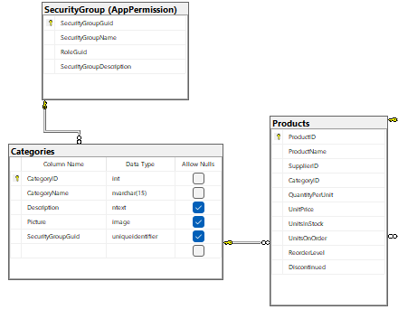
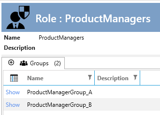
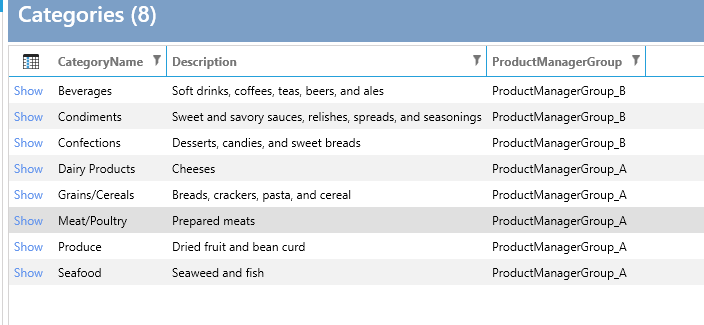
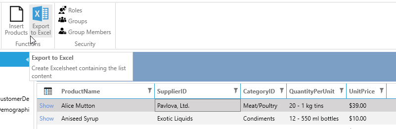
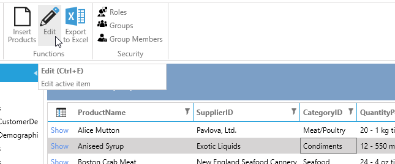

# Customize

In this tutorial, we will demonstrate how to expand and integrate the Security AppExtension into your existing data model.

We will use the Northwind database as our starting point.

**Scenario 1:** We aim to restrict who can edit the products, ensuring not all users have edit permissions.
First, we create a "ProductManager" role and a "CanEditProduct" operation, which will be used in EntitySecurity.

**Scenario 2:** Next, we expand Scenario 1 into : Certain users should have access to edit only specific products based on the product's category.

To set up the "standard" Northwind database on an empty SQL database, run the script available [from GitHub](https://github.com/microsoft/sql-server-samples/blob/master/samples/databases/northwind-pubs/instnwnd.sql).

Create a new IDP solution with the new database.

Initially, everyone can edit products.



## Scenario 1

To restrict who can edit the products, follow these steps:

1. Add the Security ArchitectureItem
2. Add a "CanEditProduct" operation
3. Add a "ProductManager" role and check the "CanEditProduct" operation
4. Click "Create code"

Now we have the basic code for checking the operation. Next, we implement the check in the EntitySecurity for products.

1. Select "Entity Framework" and select "Products"
2. Add code from the `code task` "Entity Security"

Customize the `ProductsSecurity`:


```cs
    public partial class ProductsSecurity
    {
        private readonly IApplicationSecurity _applicationSecurity;

        public ProductsSecurity(IApplicationSecurity applicationSecurity)
        {
            _applicationSecurity = applicationSecurity;
        }

        public override bool CanUpdate()
        {
            return _applicationSecurity.CanEditProducts;
        }
    }
```

Now no one can update products as we have not added any users to the role "ProductManagers". (The Edit-button is not shown)



Now we implement the Security AppExtension to manage the roles/groups/members.

1. In the designer, click the "Designer" tab and then click "Add AppExtensions"
2. Choose `Security - only Roles and Groups`
3. Follow the readme.txt for the implementation.

Now when you run the application, you can manage roles/groups/members. In the application, do the following:

1. Add a Group "ProductManagerGroup" and select the role "ProductManagers"
2. Add members to that group. (I just added myself)



Restart the application to load the new security.

Now I, and only I, can edit products.



## Scenario 2

Certain users should have access to edit only certain products depending on the product's category.

This scenario can be handled in different ways:

- If there are two productmanagers today: Just create two roles, two operations, and two groups, but this method is not flexible. If we want ProductManagers for each category, we need to change the code each time a new category is added.
- Change the data model in Northwind so you can choose which group can edit which category.

We will implement the latter.

We will start by changing the data model:

1. Add a new column `SecurityGroupGuid` to the table `Categories`
2. Add a relationship between the tables `dbo.Categories` and `AppPermission.SecurityGroup`



Open the designer:

1. In `Entity Framework`, add `AppPermission.SecurityGroup` and click "Create code"
2. In `User Interface`, select `Categories` and add the field `SecurityGroupGuid` to show/list/edit/insert
3. Change the UpdateControl to `ComboboxWithContains` and the binding path to `SecurityGroup.SecurityGroupName`
4. Set the binding path for the label to `SecurityGroup.SecurityGroupName`
5. Change the caption to `ProductManagerGroup`
6. Click `Create code (for selected)`

Run the application.

1. Edit the group `ProductManagerGroup` and change the name to `ProductManagerGroup_A`
2. Add a new group `ProductManagerGroup_B` to the role `ProductManagers` and add members to it (for testing purposes, add another user besides yourself)

So we end up with this:



Now click on `Categories` and edit the first one to set the `ProductManagerGroup`. Repeat this for all categories so we end up with this.



Now we can implement the expanded security.

1. In the Security ArchitectureItem, add `Code Task` for `ApplicationSecurity` and customize it like this:

```cs
    public partial interface IApplicationSecurity
    {
        List<int> CategoriesThatCanBeEdited { get; set; }
    }
    
    public partial class ApplicationSecurity
    {
          public List<int> CategoriesThatCanBeEdited { get; set; }=new List<int>();
    }
```

The property `CategoriesThatCanBeEdited`should hold the Id's for the Categories that the currentuser can edit.

Now we can implement this in the ProducsSecurity by adding this:

```cs
public partial class ProductsSecurity
{
    private readonly IApplicationSecurity _applicationSecurity;

    public ProductsSecurity(IApplicationSecurity applicationSecurity)
    {
        _applicationSecurity = applicationSecurity;
    }

    public override bool CanUpdate(Products entity, object sourceEntity = null)
    {
        if( base.CanUpdate(entity, sourceEntity))
        {
            if (entity.CategoryID.HasValue)
            {
                return _applicationSecurity.CategoriesThatCanBeEdited.Contains(entity.CategoryID.Value);
            }
            else
            {
                return true;
            }

        }
        return false;
    }

    public override bool CanUpdate()
    {
        return _applicationSecurity.CanEditProducts;
    }
}
```

The last step is to set the values in `CategoriesThatCanBeEdited`:

1. In the Security ArchitectureItem add `Code Task` SecurityBuilder and customize it like this:

```cs
 public partial class ApplicationSecurityBuilder
 {
     private readonly ICategoriesEntityService _categoriesEntityService;

     public ApplicationSecurityBuilder(IApplicationCurrentUser currentUser,
                                       IApplicationSecurity applicationSecurity,
                                       ISecurityHandler securityHandler,
                                       ICategoriesEntityService categoriesEntityService) 
         : this(currentUser, applicationSecurity, securityHandler)
     {
         _categoriesEntityService = categoriesEntityService;
     }
     public async override Task Build()
     {
         await base.Build().ConfigureAwait(false);

             if (this.Settings.CanEditProducts)
            {
                //_permission holds the roles, groups, operations of the current user.
                var groupGuids = _permissions.SecurityGroups.Select(e => e.SecurityGroupGuid).ToList();

                this.Settings.CategoriesThatCanBeEdited = await _categoriesEntityService.GetProductManagersCategories(groupGuids).ConfigureAwait(false);
            }
     }
 }
```

We have customized the Categories EntityService with the methode `GetProductManagersCategories` like this: 

```cs
    public partial interface ICategoriesEntityService
    {
        Task<List<int>> GetProductManagersCategories(List<Guid> groupGuids);
    }
    
    public partial class CategoriesEntityService
    {
        public async Task<List<int>> GetProductManagersCategories(List<Guid> groupGuids)
        {
            using (var ctx=this.DbContextFactory.CreateDbContext())
            {
                return await ctx.Categories.Where(e =>
                        e.SecurityGroupGuid.HasValue &&
                        groupGuids.Contains(e.SecurityGroupGuid.Value)).Select(e => e.CategoryID)
                        .ToListAsync();
            }
        }
    }
```

Run the application and now you can only edit products, if you are member of the "right" productmanager group.

I can not edit this product:



But this I can:

