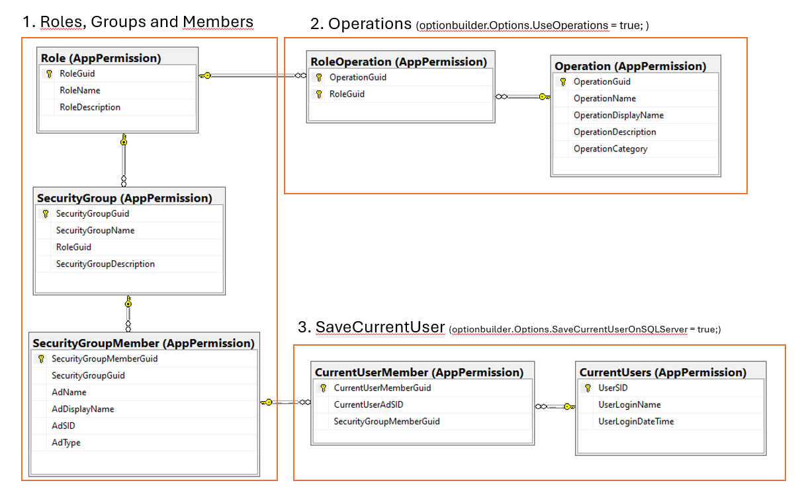
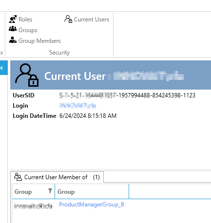

# Implementation

Requirements:

1. The ArchitectureItem "Security" is added to the designer (if not the appextension will not be shown)
2. Some operations (and roles) has been defined (you can keep add/delete operation/roles in the designer)

To implement Security Extension:

1. Add AppExtension: Choose on of the "Security" AppExtension
2. Follow the instructions in the readme.txt

When you have implemented the Security AppExtension there are created 7 SQL tables in the database and the UI for maintaining these tables is added either to your Ribbon og OutlookBar.

The 7 tables are use depeding on what you have chosen.




When you "Create code" in the designer (in "Security") there are now also generated a "InsertData-sqlscript.sql" in the Security-folder in the data project.
If you have defined roles and operations in the designer, these are in the sql-script. So if you run the sql-script the roles and operations are inserted into the database.

Before the Security AppExtension you needed to add the current user to roles in code [see here](../../tutorials/Security/addusertoroles.md) in the `ApplicationSecurityBuilder`.

The Security AppExtension files out the Roles with data from the database.

## Save CurrentUser On SQLServer

The Security AppExtension can be configured to save the current user and he/she's groupmembership to the SQL database each time the user logins in the application. When the user exits the application the data is deleted. You configure it in the app.xaml.cs:

```cs
            ApplicationBuilder
             .AddSecurityAppExtension(optionbuilder => { 
                 optionbuilder.Options.SaveCurrentUserOnSQLServer = true; 
             });
```

When this is configured you get some extra UI where you can see which users that are currently logged in the application and their groupmembership.



