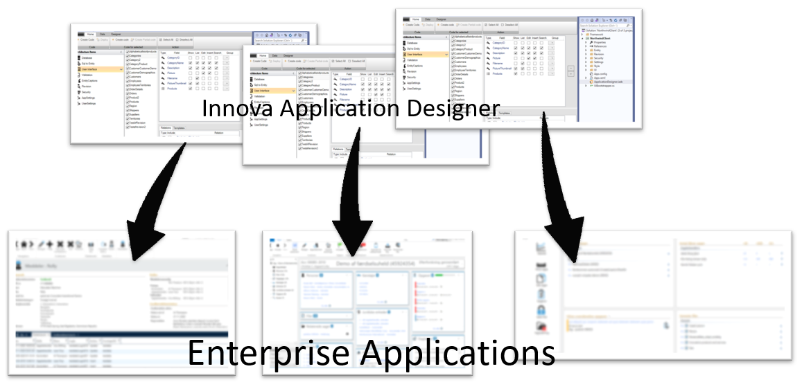

# The Process

With the Innova Developer Platform, you get a uniform development methodology for all business applications, ensuring consistency in terms of technology, design patterns, etc.

This means that if you are responsible for, let's say, 10 business applications in your organization, you achieve a homogeneity in development that is challenging to achieve through other methods.

As the specific architectural elements are continuously updated with new versions, for example from Microsoft, even older applications will receive these updates automatically the next time you generate code.