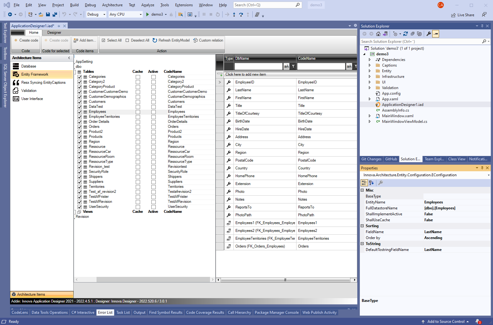

# The Product

The "Innova Developer Platform" is a combination of two tools:

- **Innova Application Designer** (An add-in for Microsoft Visual Studio)
- **Innova Frameworks**

## Innova Application Designer

Innova Application Designer (IAD) is a development tool that is integrated with the Microsoft Visual Studio environment. With IAD, developers get the opportunity to carefully configure the different layers in an application's architecture. After this careful configuration, it becomes possible to auto-generate code directly in Visual Studio.

By using IAD, developers get a tangible visual presentation of which architectural elements they want to include in the application, as illustrated below.

This screenshot is a snapshot directly from Visual Studio. Note that the "Solution Explorer" is located to the right, while IAD dominates the left side. A single double-click on the file "ApplicationDesigner.iad" from the "Solution Explorer" opens the IAD interface.

The far left column of IAD displays the chosen architectural elements. After choosing a specific architectural element, you can dive deeper and customize it. As exemplified, by choosing "Entity Framework", it becomes possible to specify which database tables should be integrated into the application's entity layer. After completing the configuration, a simple click on the "Create code" button activates the auto-generation of C# code for the entire entity layer. This code can then be viewed, and if necessary adjusted, via the solution explorer.

IAD is constantly growing; new architectural elements are added, and existing elements are updated, especially when newer technological frameworks, such as Entity Framework/Entity Core/Entity 6.0, become available.

Each architectural element retrieves metadata from underlying elements, which facilitates the configuration process.

### Customization of the generated code

The generated code is designed to be as flexible as possible. Since the code is generated as a "partial class", developers can easily tailor the code to a specific application's needs. Further guidance can be found in our How-To Guides.

## Innova Framework

Innova Framework offers a comprehensive collection of development tools and frameworks designed to extend and complement popular .NET frameworks.:

- [Entity Framework](https://github.com/dotnet/efcore)
- [Fluentvalidation](https://docs.fluentvalidation.net/en/latest/)
- [AutoMapper](https://automapper.org/)
- [Microsoft.Extensions.Logging](https://learn.microsoft.com/en-us/dotnet/core/extensions/logging?tabs=command-line)
- [.NET dependency injection](https://learn.microsoft.com/en-us/dotnet/core/extensions/dependency-injection)
- [Prism](https://prismlibrary.com/docs/)
- [Telerik](https://www.telerik.com/)
- [Infragistics](https://www.infragistics.com/)