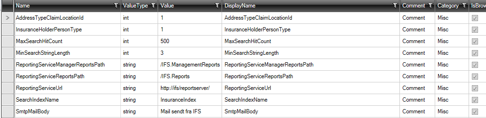

# Appsettings 

The purpose of the "Appsettings" elements is to implement application variables stored in the SQL database instead of, for example, a configuration file.
This allows application variables to be changed continuously, for example, within the application by an administrator.

To add "Appsettings", select the "Designer" tab and click on the "Add ArchitectureItem..." button and choose "Appsettings".

The designer for "Appsettings" looks like this:

Here you can enter parameter names in the list under "Name" and the .net type in "ValueType".

The rest of the fields are only used if you want to display all appsettings in a property grid (see later).

When you generate code, two files are created:

- AppSettings.tt.cs 
- AppSettings.tt.sql

The SQL file contains the SQL script to create the table and insert data into the table.

The cs file contains the code, which allows you to now use appsettings in the application.