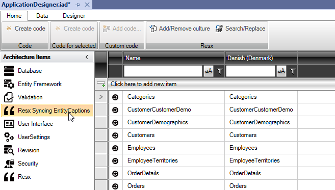
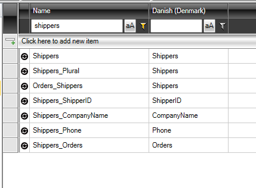
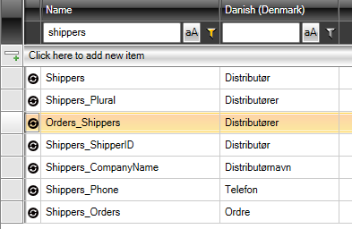
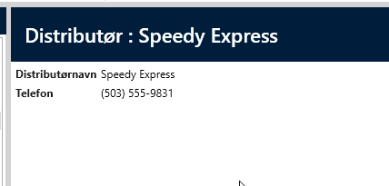
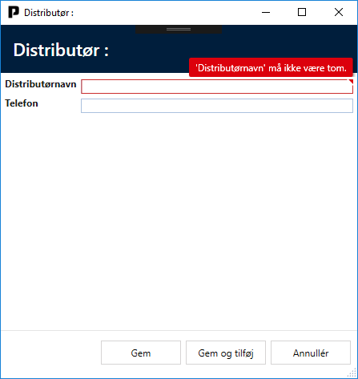

# Resx Syncing EntityCaptions

"Resx Syncing EntityCaptions" builds on top of "Resx".

The purpose of "Resx Syncing EntityCaptions" is to translate the names of the data model and thereby make the application multilingual. It reads metadata from "Entity Framework" (class names and properties) and creates the entries in the list itself.

To add "Resx Syncing EntityCaptions", select the "Designer" tab and click on the "Add ArchitectureItem..." button. Choose "Resx Syncing EntityCaptions".

You will then get the following designer:

The first column contains the terms that the code uses, and the next column (under "Danish (Denmark)") is a list of the terms/headings displayed in the application.

New languages can be added by clicking on "Add/Remove culture".

You can search in the list under "Name" or "Danish (Denmark)".

Example:

Search for "shippers" under "Name", and the designer will look like this:

In the "Danish (Denmark)" column, you can now adjust the terms/headings you want to have in the application.

Click on "Create Code" and run the application. The screens will now have the new terms/headings:

It is also possible to change Captions for entities in the "User Interface" architectural element.