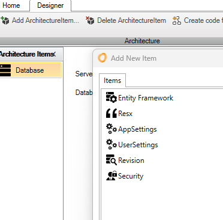
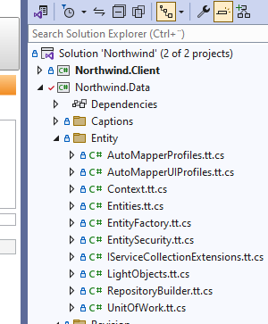

# The Process

The Innova Developer Platform operates through a simple, yet effective three-phase process:

1. **Selection of architectural element:** In the designer, the necessary architectural elements for the application are selected.
   
   

2. **Configuration of architectural element:** Each architectural element is configured and customized as needed.

3. **Code generation:** After configuration, click on "Create code", and the customized code is automatically produced.

   

The generated code is presented directly in Visual Studio's solution explorer. Code files with the extension "*.tt.cs" should not be modified, as they will be overwritten at the next code generation. Thanks to partial classes, there is the possibility to build upon the generated code by adding your own methods.

