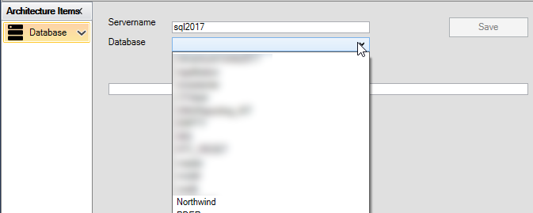
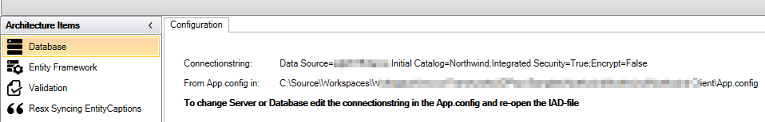

# Database

The purpose of "Database" is to configure which database you want to use in the application.

There are 2 configuration options:

- Server name: the name of the SQL Server
- Database: the name of the database

By entering the name of the SQL Server, the database names are presented in the dropdown list under "Database". Here, select Northwind and click on "Save".

It will create the connectionstring and insert it into the app.config.

If you want to change the connectionstring you can change it in the app.config and then open the IAD-file.

The designer connects to the database via this connectionstring:

