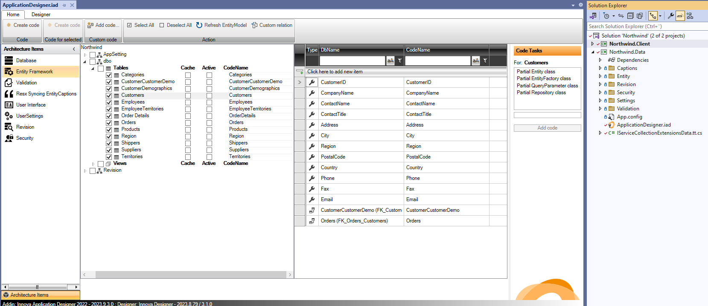
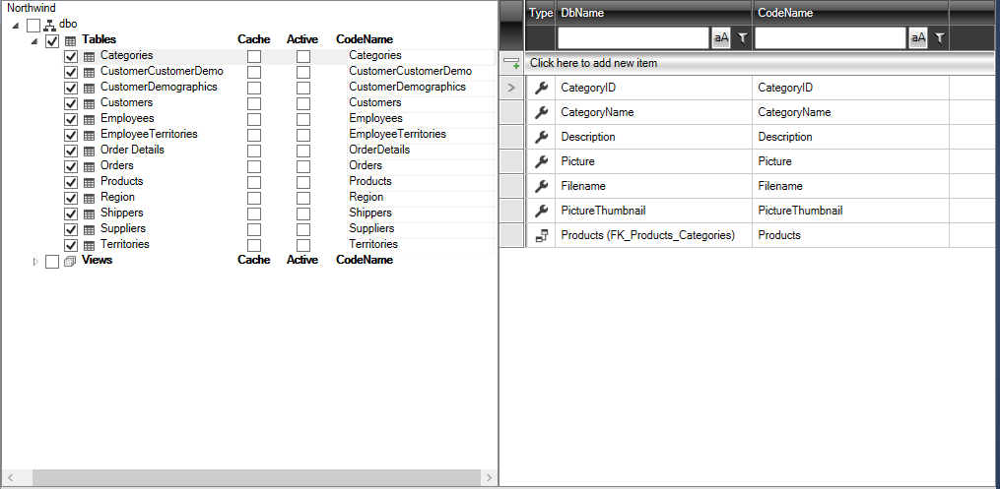
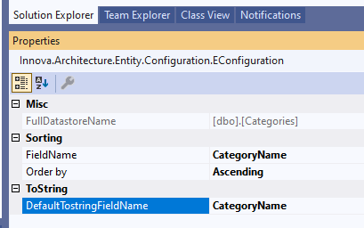
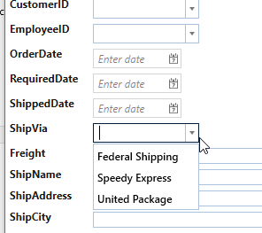
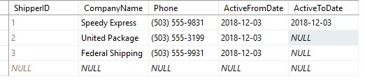
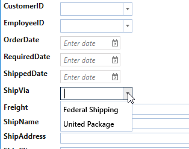

# Entity Framework

The "Entity Framework" element is primarily used to select which tables and views from the SQL database you want to incorporate into your application.

After adding this architectural element, you are presented with the following configuration screen:

The screen shows a list of all tables and views in the database. Mark the desired tables/views by clicking on the checkboxes next to them. To select all tables under "Tables", simply mark this.

As shown below, all tables are selected:

After configuration, the code needs to be generated. Click on the "Create Code" button located farthest to the left:

Now the application has a fully operational data layer, and you can, for example, start updating data in the database. The rest of the configuration settings will be covered later, but you can already add additional architectural elements to your application.

If the data model changes in the SQL database, the change will automatically be reflected in the designer the next time it is opened. Then it's just to click "Create Code" and the new data layer is code generated.

## Configuration

In the "Entity Framework" configuration, the following settings will be automatically set:

- Entity name (default is the table name)
- Entity attribute names (default names of the table fields)
- Default ToString method for the entity
- Default sorting for lists
- Implementation of caching
- Implementation of "Active" status

### Customization of entity names

In the design window, you can change the name of an entity in the right column if you, for example, do not want certain attributes to bear the database field name. This can be done in the "CodeName" column:

### Customization of default ToString

As a general rule, the first text field in the entity is used as ToString for this entity.

To change this, select "Entity Framework" and then click on the entity "Categories". Now the configuration settings for "Categories" should be displayed in the property window in Visual Studio.

"DefaultTostringFieldname" is by default set to CategoryName. 

This can be changed by selecting another field from the dropdown menu. 

### Customization of sorting

A default has already been set for which field to sort by (the first text field) and the direction of sorting (Ascending or Descending). This can be changed by selecting another field from the dropdown list.

### Implementation of cache

Caching is typically used in tables where data rarely changes. This is typically relevant for lookup/value tables. By enabling caching for an entity, data will be fetched from the SQL database the first time, while all subsequent requests will pull data from the application's local cache. The cache content will be deleted at application termination, so at the next startup, data is first fetched from the database and then from the cache.

You can configure caching either from the property window for the specific entity or directly in the designer window. Below, caching is enabled for Region, Suppliers, and Territories:

### Implementation of "Active"

The "Active" function is often used for lookup tables to control when a particular row in the table is active and therefore should be displayed in the application. To illustrate this, let's take an example:

Suppose the entity/table "Shippers" contains suppliers who can handle individual orders. Over time, it may become necessary to replace suppliers. But it is important still to be able to identify which supplier handled a previous order. Therefore, when a new order is created, the dropdown menu for suppliers should only show the "active" suppliers. But for older orders, "inactive" suppliers should still be visible.

To implement the "Active" functionality on Shippers, mark "Active" for Shippers and then click on "Create Code". This will generate a SQL file that adds two new fields to the Shippers table:

- ActiveFromDate: indicates from which date the row is active
- ActiveToDate: indicates to which date the row is active

After running the SQL file on the database, you will notice that ActiveFromDate is by default set to today's date.

To update the entity model, open and close the designer. Each time the designer is opened, it will fetch the latest metadata from the SQL Database and any changes will be displayed in the designer.

Then press "Create code". Then run your application, select the order list and click on "Add". The "ShipVia" field will contain a dropdown list with all three suppliers:

But if a value is specified in ActiveToDate:

The dropdown list will not show "ShipVia" for this supplier:

This provides an easy way to manage lookup tables using the "Entity Framework" configuration.