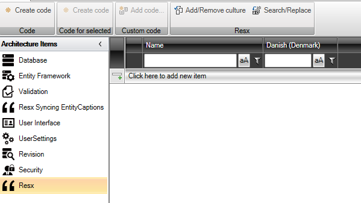
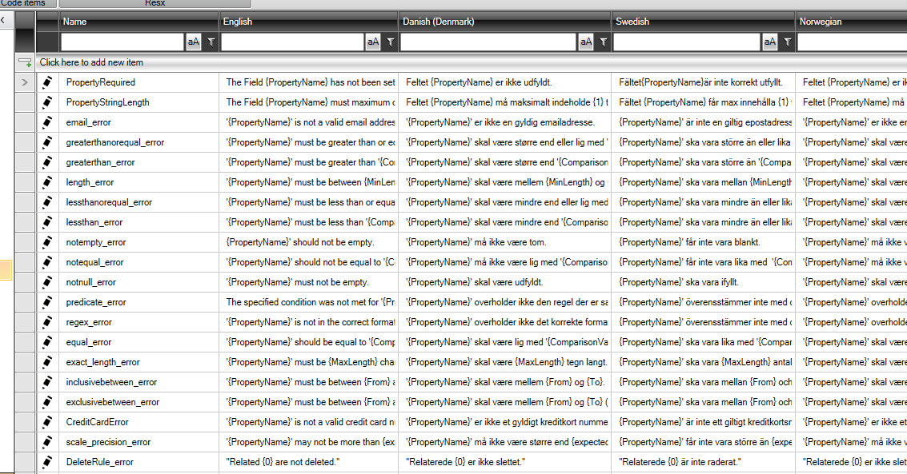

# RESX

"Resx" offers a centralized approach to managing all text used in an application. This makes it simple to implement multilingual support and ensures that the application can reach a wider audience with different language preferences.

The generated codes from this tool are resx files. These files are known and commonly used within [Localization in .NET](https://learn.microsoft.com/en-us/dotnet/core/extensions/localization). Resx files are XML-based and contain key-value pairs, where the key represents a unique identifier for a given text string, while the value represents the text itself.

With "Resx", developers can easily:

1. **Centralize text**: All text messages, labels, and UI element texts can be centrally managed from the resx files.
  
2. **Switch languages dynamically**: By switching the active resx file, the application can dynamically change languages, making it easy to switch between different language versions.

3. **Support multiple languages**: By adding more languages, developers can easily expand their application's language support.

4. **Maintain text**: Changes in text or the addition of new texts can easily be implemented by updating the "Resx" without necessarily having to change the actual code in the application.

5. **Integrate with .NET**: Since the resx format is deeply integrated with the .NET platform, developers can take advantage of tools and libraries specifically designed to work with resx files.

To maximize the benefits of "Resx", developers should ensure to consistently refer to texts via their resx keys instead of hardcoding text strings directly into the code. This will ensure that the text can be changed or translated without having to dive deep into the application code.

## Configuration

After adding the "Resx" architectural element, the following is used to configure texts:

By default, there are two columns "Name" and "Danish (Denmark)". In "Name", enter the key used in the code and in "Danish (Denmark)" enter the text to be presented in the Danish version of the application.

Of course, it is possible to add additional languages. Click on "Add/Remove culture" to do this.

Here is shown an example of an application that supports English, Danish, Swedish, and Norwegian.

When all text is entered, click on "Create Code" and a resx file is generated per language.