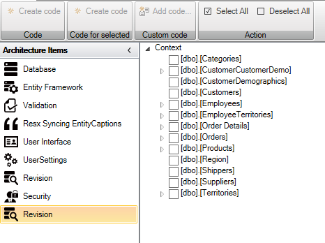
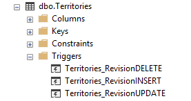
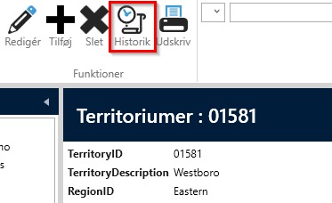
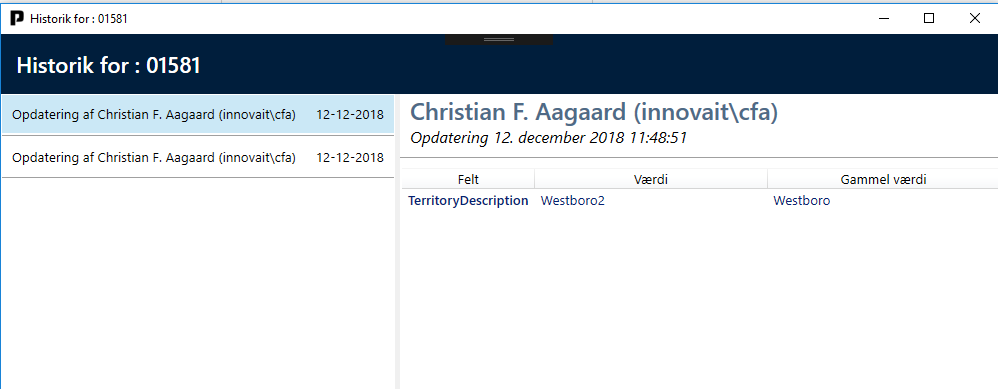

# Revision

The purpose of the "Revision" element is to implement data history for each entity/table.

To add "Revision", select the "Designer" tab and click on the "Add ArchitectureItem…" button and choose "Revision".

The designer for "Revision" looks like this:

It is possible to check the entities/tables that should have revision.

If you check "Territories" and click on "Create Code", the following code will be generated.

Run "AlterScript.sql" in the Northwind database. The script will create a "Territories" table in the "Revision" schema with the following fields.

And SQL Triggers are created on the "Territories" table.

Now the database is ready to handle revision. Any change in the "Dbo.Territories" table will be reflected in "Revision.Territories".

Run the application. Select the list of "Territories" and choose a "Territory". Note that a new button has appeared in the toolbar.

Click on "Edit" and change the "Description" and click on "Save". Then click on the "History" button. A window will open:

On the right side, it lists who and when something was changed on the respective person entity. On the left side, the change in question is shown; which field and old and new value.