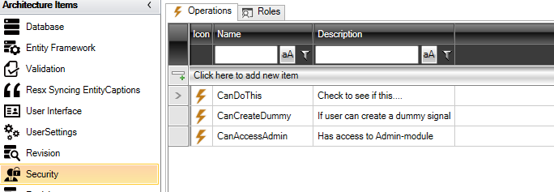
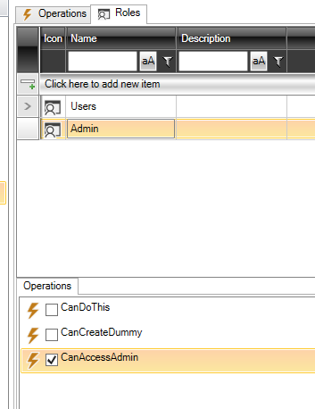

# Security

The purpose of "Security" is to control what each user has access to in the application.

In the "Security" element, two things are configured:

- Operations
- Roles

## Operations

Operations are what you will ask if the user has access to. For example, with a button.

Here, "CanAccessAdmin" is defined among other things, and it is used to ask if one should have access to "Administration" in the application.

## Roles

Under roles, the roles that are in the application are defined. In this case, "Users" and "Admin" (Administrators) are defined.

Below, you choose which operations each role has access to. In this case, the administrator role has access to "CanAccessAdmin".

