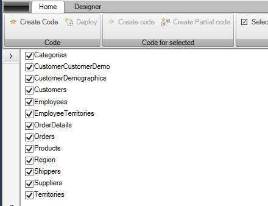
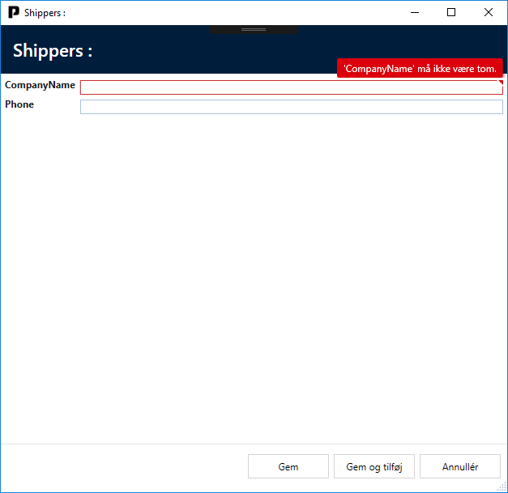
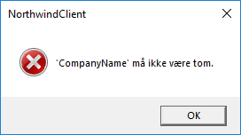

# Validation

The purpose of "Validation" is to generate code for the validation rules for each table/entity. For example, if a SQL table contains a field that cannot be "null", a validation rule will be generated to ensure that this rule is adhered to. This will also inform the user that the field needs to be filled out.

To introduce "Validation", you first need to navigate to the "Designer" tab and then click on "Add ArchitectureItem...". From here, you choose "Validation".

Next, you have the opportunity to choose which entities should have validations generated for them. On the toolbar, you will find a "Select all" button; by clicking on this, all entities will automatically be marked.

After completing the configuration, you click on the "Create code" button. This will result in the addition of a new file named "Validators.tt.cs" in the entity folder.

Now when you start the application and select "Shippers", followed by a click on "Add", you will see the following screen:

If you try to click on "Save" without having filled out the necessary fields, the following error message will be presented:

