# User Interface

The purpose of the "User Interface" element is solely to configure and generate code for the application's user interface.

[!note] "User Interface"
    In the following example, components from Telerik are used in the application.

    Innova IT has code generation for [Telerik](https://www.telerik.com/) and [Infragistics](https://www.infragistics.com/).

Select the "Designer" tab and click on the "Add ArchitectureItem" button, choose "User Interface".

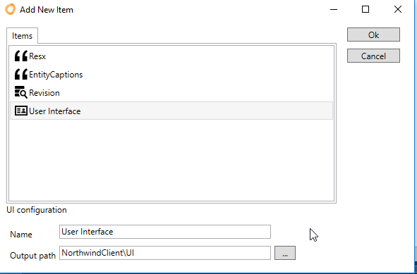

## Configuration

When the "User Interface" element is selected, the following designer is displayed:

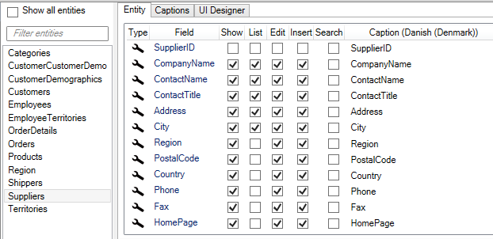

The left side lists all the entities that are selected to generate screens for. To see all entities in the application, click on "Show All entities". Here, entities are selected by checking the box.

The right side lists the fields of the selected entity. For each entity, 5 screens are created:

- Show - screen to display the individual entity.
- List - screen with a list of entities.
- Edit - screen for editing the individual entity.
- Insert - screen to insert a new entity.
- Search - screen for searching.

By checking a box next to a field, under a "screen", it means that the field will be included in the screen.

So in the example above, the fields: CompanyName, ContactName, ContactTitle, Address, and City will be shown in the list for Suppliers.

### Controls

It is auto-configured, which controls (text field, label, dropdown menu, etc.) should be used in individual fields in display, editing, insertion, and search. This is based on rules about the data type and any relationships.

For example, for the entity "Territories"

| Data types | 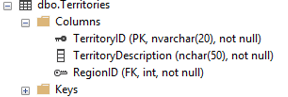 |
| Data |  |

The auto-configured control for the "TerritoryDescription" field is set to "Label" on Show and Textbox as UpdateControl (insert, edit, and search). This can be seen by selecting the "TerritoryDescription" field in the designer, then the configured values are displayed in the Properties window in Visual Studio.

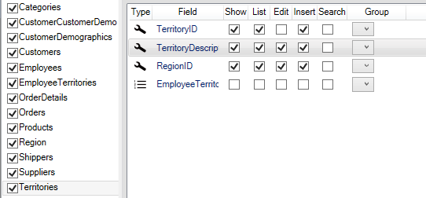

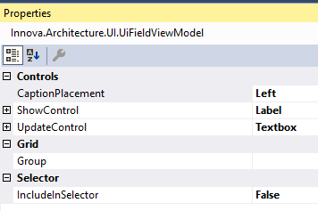

| Show | Edit | Insert |
| -------------------------------------------- | ---------------------------------------- | ----------------------------------- |
|  | 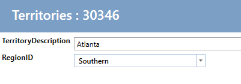 | 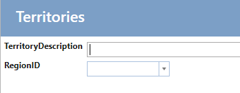 |

These can be configured to other controls by changing e.g. UpdateControl "Textbox" to "BigTextBox" (a large text box with line breaks). Click on "Create Code" and run the application. Then the insert/edit screen / view will look like this:

For the field / property "RegionID" there is a relation to "Region" and the control is automatically set to Label for Show and "ComboBox - Telerik" for UpdateControl:

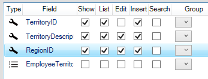

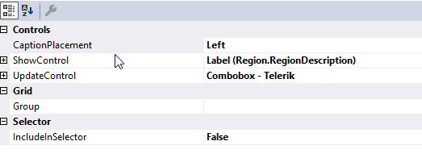

And editing / insertion looks like this:

The following controls are available:

| Control name | Description |
| --------------------------------------- | ------------------------------------------------------------------------------------------------ |
| Calendar - Telerik | Telerik - RadDateTimePicker |
| Checkbox | Checkbox |
| Checkbox - Readonly | Checkbox, primarily used for display template |
| Checkbox list | Checkbox list, used for many-to-many relationships |
| Combobox - Telerik | Telerik radcombobox, filtering values according to what is written in it. |
| ComboboxWithContains - Telerik | Telerik radcombobox, filtering values according to what is written in it and displays the list. |
| Combobox with add button - Telerik| Combobox, where you can add entities to the combobox |
| Custom control | Custom control, selected if you want to code your own control for the specific field. |
| Currency - Telerik| RadMaskedCurrencyInput |
| Image - Editor | Edit a varbinary field in the database. Upload files. |
| Image - Show | Displays a varbinary field from the database as an image. |
| Label | A text block with the option to set format string. |
| LabelList | A list that shows related entities as a list. |
| LinkButton | A button that appears as a hyperlink. Used to display data on a clickable label. |
| Numeric - Telerik| RadMaskedNumericInput |
| RadioButtonList | displays a Radiobutton list with related entities |
| Textbox - Telerik| RadWatermarkTextBox  |

### Relations

Under the list of fields, the entity's relations are listed. If a check is placed in the relation, the relation is displayed as a tab on the show page.

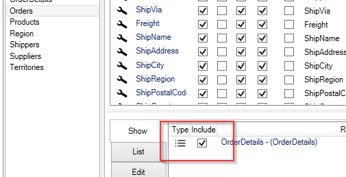

Here is the result of the above configuration.

## Captions

By selecting the "Captions" tab, all captions, tooltips, and Watermarks for the individual entity can easily be maintained.

Below is shown for Categories.

## UI Designer

By default, all fields in show/edit/insert are displayed in a row. This can be customized by using the "UI Designer" tab.

In the "UI Designer", a grid with x number of Columns and x number of Rows is designed. A cell can then contain a Group of fields. Below is shown a configuration of a grid for Employees

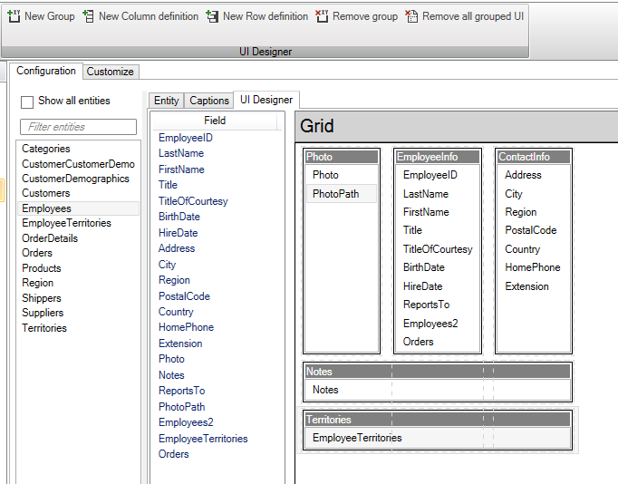

This configuration makes the show/edit/insert will be displayed as below:

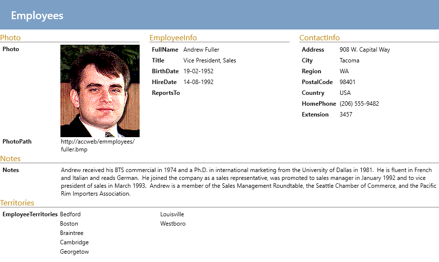