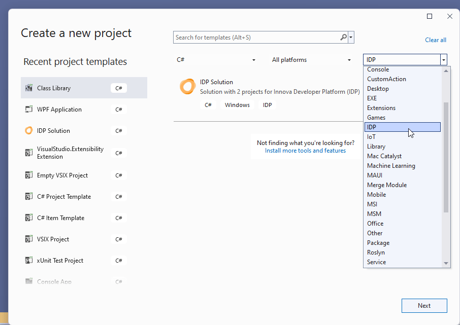
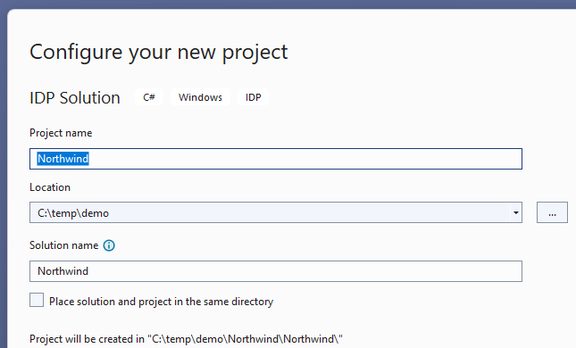
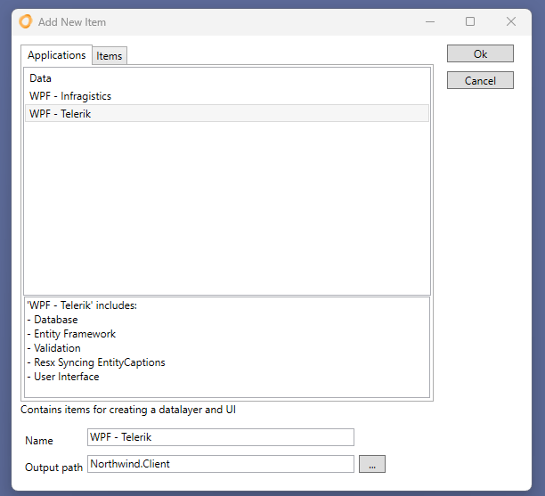
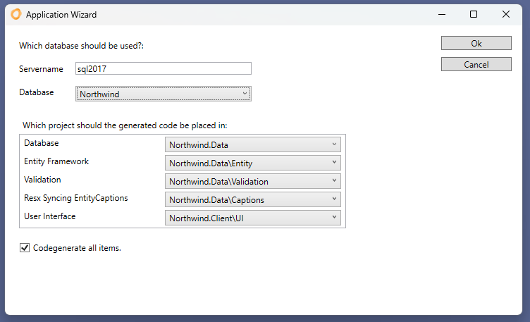
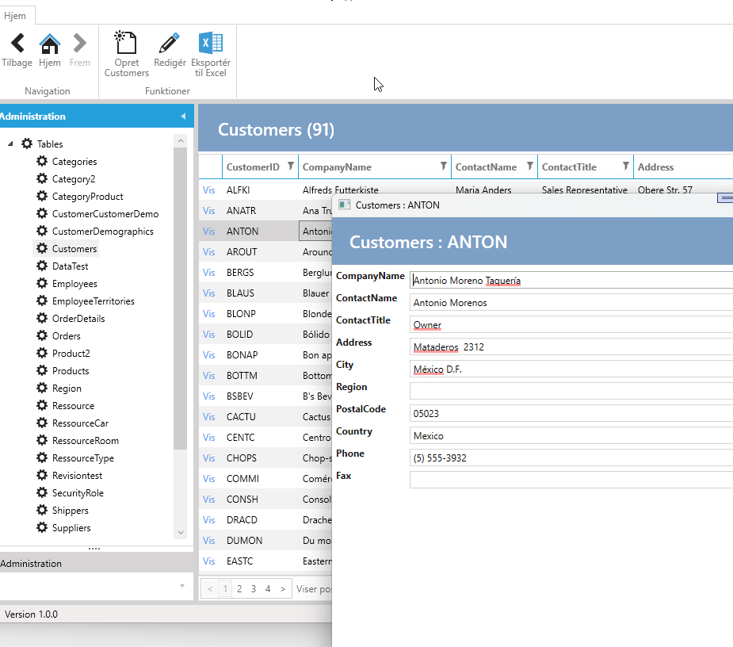

# First Application

It doesn't take long to get the first application ready.

<iframe width="560" height="315" src="https://www.youtube.com/embed/yoSoRPW3bNQ?si=-KmyoaimZQiN9PsQ" title="YouTube video player" frameborder="0" allow="accelerometer; autoplay; clipboard-write; encrypted-media; gyroscope; picture-in-picture; web-share" allowfullscreen></iframe>

The IDP comes with a project wizard in Visual Studio. Choose "IDP Solution" in "Create new project". It's possible to filter in "Project Types" and choose "IDP".

Click Next. Fill in the name and click Create.

The wizard creates a solution with 2 projects:

- *Applicationname*.Client
- *Applicationname*.Data

In the data project, an IAD file has been added, which contains the configuration.
This is automatically opened and shows 3 possible application types:

Choose "Wpf - Telerik" and click ok.

Enter SQL Server name and choose database and click ok.

Run the project. It is now possible to navigate between tables/entities, edit, insert, and delete data.

The next step is to customize the application with, for example, navigation buttons, user interface adjustments, etc.