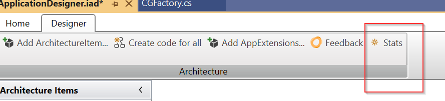
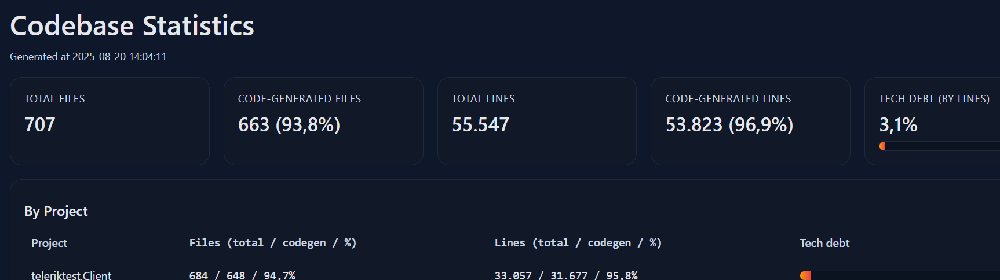
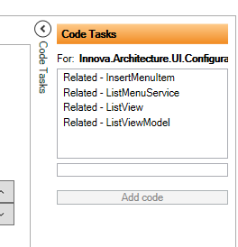
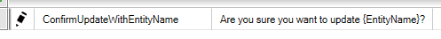
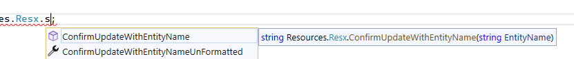
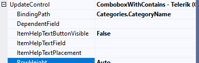
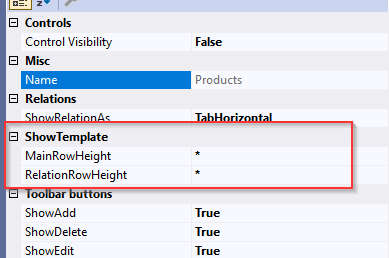
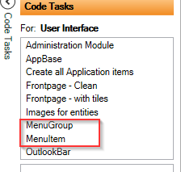

## 2025.8

### New Features & Improvements
- **CancellationToken support in async methods**  
  All asynchronous methods and calls now support *CancellationToken*, providing better control over operation cancellation.  

- **Default filter operator for Telerik lists**  
  Added a *SetDefaultFilterOperator* extension to define default filter behavior on Telerik lists.  

- **Property validation as async**  
  Property validation now supports asynchronous execution.  

- **FluentValidation – Warnings/Information in UI**  
  Warnings and informational messages from FluentValidation are now displayed in the UI with custom theme styling.  Setting severity [see more here](https://docs.fluentvalidation.net/en/latest/severity.html)

- **ElasticSearch integration**  
  The framework now supports ElasticSearch.  (Beta version. No designer yet.)

- **AdminMenuFactory update**  
  The sort order for the Admin tab has been changed from *1* to *100*.  

- **Structured search**  
  Added support for the *"in"* operator in structured search.  

- **SqlDefaults – dbContextExtensions (Breaking Change)**  
  - New option to fetch default values from SQL Server when creating entities.  Read more [Here](../tutorials/Entity/EntityFactory.md)
  > [!IMPORTANT]  
  > Breaking change
  > - partial method `SetDefaults` is replaced by overriding `SetValues` in the EntityFactory.  
 
- **Designer: IAD-file saved in multiple files (Beta)**
  - Read more [Here](../tutorials/iad_file_split.md)

- **Codebase statistics**
  - See code-generated statistics from the designer.


  - It produces a html-page with codebase stats
  


### Fixes
- **CodeAnalysis warnings**  
  Fixed CA2016 warnings (proper forwarding of CancellationToken parameters).  

- **Related list generation**  
  Fixed error in code generation for related lists.  

- **Designer – SQL View Code Task**  
  Fixed issue so CRU operations on other entities now work correctly.  

- **Custom property mapping**  
  Fixed issue where custom properties were not mapped correctly during edit/insert.  

- **Unity.Microsoft.Dependency**  
  Fixed issue with handling keyed service registrations.  

- **StreamHelper**  
  Fixed issue where `app.role/password` was ignored.  

- **Telerik Mask generation**  
  Fixed issue where masks were not generated (CG).  

- **Font size on 4K monitors**  
  Adjusted UI font sizes to display correctly on 4K screens.  (New VSIX need to be installed)

- **Entities with 'IsActive' not shown correctly in List and Show template**
  Now supports filtering and sorting in List.

## 2025.2
- AppExtension-Security: Implemented ActiveDictoryPicker.
- Fixed: Designer: Resx bug (import data)
- Fixed: StreamHelper bug fixed
- Fixed: LabelList sorting 

## 2025.1
- Support for .NET 9 (supports .net 4.72, 8.0 and 9.0)
- All Nuget-packages are now zipped in one file (Innova assemblies and their dependencies. Not Telerik and Infragistics assemblies). The zip-file can be found in source control in the folder 'vsix'.
- *CG of modules has breaking change (see below)*
- UI: Related list add-menus: Added sortorder to match Tab order
- UI: All standard menuitems are now registred with interfaces instead of types.
- Designer: new code tasks for related list. If you select a related list (on the show template). You will get 4 new code tasks!




- UI: in the Show/edit/insert viewmodel you can now set Visibility for a property. Both Caption and Value will be collapsed.
    SetVisibility(e=>e.CategoryName, false);
- Refactored Streamhelper to support SQL ApplicationRole and not to log the full binary stream into the log.
- Designer: Resx files: Methodes with parameters. If your string contains {0} or fx. {EntityName}



Now you have both as a methode or as property:



- UI: Combobox with databound HelpText. Either as Tooltip for each ComboboxItem or as a HelpButton next to the combobox.



- CheckBoxList MinHeight changed.
- Designer: Configure height of ShowTemplate (MainRowHeight) and the tab-control with the related lists (RelationRowHeight). Can be configured on the show template.



- *Framework: List and create entity. New property on ListViewModel (SubscribeEntityCreateEvent). Breaking change*
- Designer: new code tasks for MenuGroup and MenuItem to be created in the MainModule.



- Framework: TileControl is now a style/ItemTemplate and can be "overriden". It is a TilControlStyle.xaml in Innova.Prism.Library / Styles.
- Various bug-fixes

> [!IMPORTANT]  
> Breaking change
>
> *CG modules*
>
> The CG of the "entity" modules has been changed. The CG now consists of an abstract base-module and a partial class that inherits from the base-module. So now you can override all methodes in the partial class. That means there is no more use for all the partial methodes and they are not CG anymore:
> - partial void AfterRegisterTypes(IContainerRegistry containerRegistry);
> - partial void AfterOnInitialized(IContainerProvider containerProvider);
> - partial void Initialized();
>
> Before:
> ```csharp
>        partial void AfterRegisterTypes(IContainerRegistry containerRegistry)
>        {
>            containerRegistry.RegisterDialog<ImportLoginsView, ImportLoginsViewModel>();
>        }
>```
> 
> Now:
> ```csharp
>        public override void RegisterTypes(IContainerRegistry containerRegistry)
>        {
>            base.RegisterTypes(containerRegistry);
>            containerRegistry.RegisterDialog<ImportLoginsView, ImportLoginsViewModel>();
>        }
>```
>
> *ListViewModel - SubscribeEntityCreateEvent*
>
> If you want your list to refresh/reload when you create an new entity you can now set "SubscribeEntityCreateEvent = true;".
> If this is false the list will not react if you create an new entity. In older versions the list would "insert" new items into the list, but with no respect to paging, sorting and so on.

## 2024.10

- More API-documentation
- Added OutlookBar Service. Read more [Here](../tutorials/UI/outlookbar.md)
- Various bug-fixes

> [!IMPORTANT]  
> Breaking change
> 
> If you have used Administration-module you should replace it with the new Administration-module. Backup your Administration folder, delete the folder and CG a new AdministrationModule in the Designer under code-tasks (User Interface).


## 2024.8

The main focus for this version has been creating a foundation for enhancing the documentation. So now the learn-website has API-documentation and we have switch to using DocFX for generating our documentation.

We have made some small changes in the Designer/code generated (CG):

- CG: Mainviewmodel is now injected with interfaces.
- CG: Implemented abstract and base-viewmodels for show, list and search, so you can override methodes instead using the CG-partials methodes.
- Designer: Hyperlink button can publish a general event to be used in your code. (instead of just userlookup og entitylookup)
- Bug: Designer does not save "order by" and tostring if a custom field is used.

> [!IMPORTANT]  
> Breaking change
> 
> Now that we are using abstract and base-viewmodels we are moving away from using partial methods (expect for Initialize() ).
> So if you have used partials methods for example with LinkButtons, those methods are now CG in the abstract viewmodel as protected virtual
> and you need to override them instead of using partial.

## 2024.6

The first AppExtensions has landed. This version includes the following AppExtensions:

-	[Logging](../appextensions/log/index.md)
-	[Security](../appextensions/security/index.md)

All AppExtensions are created with IDP and are fully opensourced (for customers). And yes, you can make your own AppExtensions.

### Designer

- Database: The connectionstring is no longer in the iad-file. It uses the connectionstring in the app.config. [See here](../gettingstarted/guide//elements/database.md)
- UI Designer now supports drag-n-drop for fields between groups.
- Checkboxlist, radiobuttonlist and comboxes has a “DependentField” property so for example if you have two comboboxes and you want the second combox’s items to be depended on the selection in the first combox then you should use this new property.
- Radiobutton and Checkboxlist’s orientation can be configured with horizontal or vertical.
- Various bug fixes and optimizations

### Framework

- **Breaking change** Implemented ApplicationBuilder which are used in the app.xaml.cs to load services, appextension and so on. 
- New Revision UI
- Added support for Swedish and Norwegian culture in the UI (beside English and Danish).
- Various bug fixes and optimizations

>[!IMPORTANT]
>Breaking change
> 
>How to Upgrade from 2024.2.57:
> 
>Backup your app.xaml and app.xaml.cs if you have made custom changes.
> 
>Run code-task “AppBase” (which will replace app.xaml/app.xaml.cs)


