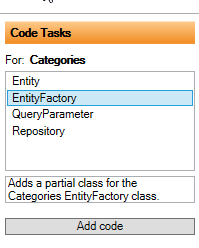

# Code Tasks - Configuration

It is shown as "Code Tasks" on the right side of the designer.

Above is shown the configuration for "User Interface", where "Categories" has been selected and the "Show" tab is selected.
Then "Code Tasks" shows which code tasks it can assist with. In this case, "Menu item" has been selected, which means that when the "Add Code" button is clicked, a menu item is added to the toolbar for the Show screen when a "Categories" is displayed.

Unlike the regular code generation (when you click on "Create code"), the generation of code via "Code Task" is a one-off, i.e., the code is only generated once and without "tt.cs", but as regular cs-files. These can therefore be freely changed afterwards.

By clicking on "Add code", the code below is generated and ready to be adapted by the developer.

Note the comment above the class, which describes how to use the code.

The different Code Tasks are shown depending on which configuration element is active. So if, for example, "Entity Framework" is selected, it is possible to create partial classes for DbContext and UnitOfWork, as shown below.

If an entity is selected, for example, Categories, other Code Tasks appear.

To make it easier to get an overview of Code Task for the individual Architecture elements, there is a "Customize" tab that shows all Code Tasks.