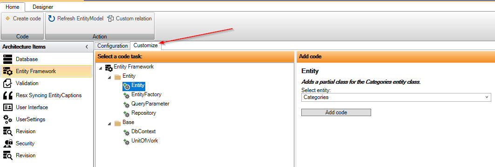
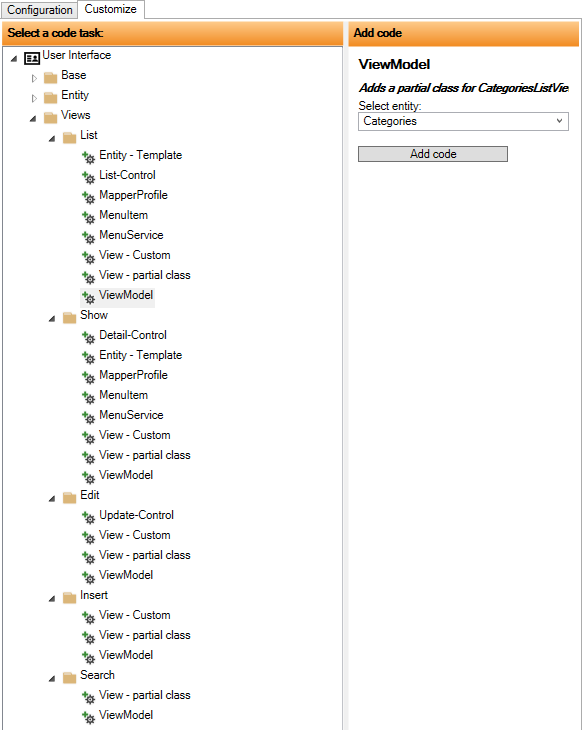

# Code Tasks - Customization

The "Customize" tab provides access to all "Code Tasks", so you are free from clicking around in the configuration to find the relevant Code Tasks.

After a Code Task is selected, the details for the Code Task are displayed on the right side. And in the above case, an entity should be selected and then click on "Add Code".

If, for example, DbContext is selected, as shown below, the list of entities is not displayed.

"Customize" is especially suitable where there are many Code Tasks. Below, "Customize" for "User Interface" is shown.

