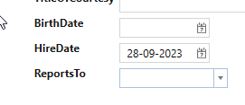

# Entity Factory

**Requirement**: The "HireDate" property on "Employees" should have a default value set to today's date when a new employee is created.

**Task**: Create a partial class for the code-generated EmployeesEntityFactory and implement the partial method "SetDefaults".

**Implementation**: 

1. Select "Entity Framework".
2. Select "Employees".
3. Under "Code Tasks", choose "EntityFactory" and click on "Add Code". An EmployeesEntityFactory.cs file will now be generated, which can be customized as desired, as shown below. 

```cs
    public partial class EmployeesEntityFactory
    {
        public override void SetValues(Employees employees)
        {
            base.SetValues(employees);

            employees.HireDate = DateTime.Now;
        } 
    }
```

Now the default value for "HireDate" will be set to today's date when a new "Employees" is created.



# New Configuration Option in Entity Framework

A new configuration option has been added to *Entity Framework* that allows you to specify whether inserted entities should receive their default values from SQL Server. This can be configured either:  
- **At the context level** – applied globally to all entities.  
- **At the entity level** – applied to specific entities only.  

Each entity’s `EntityService` now includes a **protected** property:  

```csharp
protected bool ShouldSetInsertDefaultsFromSql { get; }
```

By default, this property is set to `false`.  

When `ShouldSetInsertDefaultsFromSql` is set to `true`, the insert operation will retrieve default values directly from SQL Server (as defined in the table schema) and assign them to the entity’s properties.  

---

## Entity Creation Flow

1. **Entity creation**  
   The entity is instantiated by `EntityFactory` via `new()`.  

2. **SQL Server defaults** *(optional)*  
   If `ShouldSetInsertDefaultsFromSql == true`, the system queries SQL Server for default values and applies them to the entity’s properties.  

3. **SetValues execution**  
   `SetValues` is called within the `EntityFactory`.  

4. **Applying `IPropertyValues`**  
   If any `IPropertyValues` are provided, they are applied to the entity.  

---

## Code Generation Changes (Breaking Change)

In `EntityFactory`, code generation has changed:  

- The following partial method is now **obsolete**:  
  ```csharp
  partial void SetDefaults(Categories categories);
  ```
- Instead, override the method:  
  ```csharp
  public override void SetValues(Categories categories);
  ```

---

## Notes on Factory Methods

- `EntityFactory` **does not** call SQL Server for defaults.  
- `Create()` **does not** call `SetValues`.  
- Use `CreateWithValues()` if you want to create an entity and set its values directly.  
- Use `EntityService.Create()` if you want to execute the **full creation flow** described above.  
