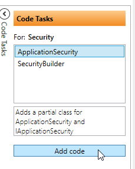

# Customize ApplicationSecurity

To customize the ´ApplicationSecurity´ you click/add the "Code Task" `ApplicationSecurity`.



Now you can add properties in the class and interface.

```cs
    public partial interface IApplicationSecurity
    {
        bool CanDoSomething { get; set; }
    }
    public partial class ApplicationSecurity
    {
        public bool CanDoSomething { get; set; }
    }
```

Then customize the build methode in the builder to set the value. [See here how to override](addusertoroles.md)

```cs
    public partial class ApplicationSecurityBuilder
    {
        
        public async override Task Build()
        {

            this.Settings.CanDoThis = true;
            await base.Build().ConfigureAwait(false);
        }
    }
```

And then you can use the `IApplicationSecurity` as you would normally do and access the `CanDoThis` property (here in the EntitySecurity for Products):

```cs
    public partial class ProductsSecurity
    {
        private readonly IApplicationSecurity _applicationSecurity;

        public ProductsSecurity(IApplicationSecurity applicationSecurity)
        {
            _applicationSecurity = applicationSecurity;
        }

        public override bool CanUpdate()
        {
            return _applicationSecurity.CanDoThis;
        }
    }
```