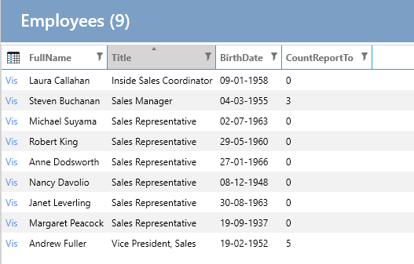

# Mapper - Custom List-property

From the previous example [Mapper](Mapper.md), a custom property was created on the data entity and then that property was used throughout the application.

It may be that there is only a need to create a custom property for a view and it is not desired to create the property on the data entity, but only the model entity.

**Requirement**: On the list of Employees, it should be displayed how many Employees an Employee has under them.

**Task**: Create a property on the EmployeesList class that counts ReportTo.

## Implementation

### 1. Create Property

1. Select "User Interface".
2. Select "Employees".
3. Select the "List" tab.
4. Under "Code Tasks" select "Entity - Model" and click on "Add Code".
5. Create a property as below:


```cs
public partial class EmployeesList
{
    public int CountReportTo { get; set; }
}
```

### 2. Make Mapping

In "Code Tasks" select "Mapper" and implement the following (FullName mapping is from a previous example):

```cs

public partial class EmployeesListMapperProfile
{
    partial void AfterConfiguration(IMappingExpression<Employees, EmployeesList> mapping)
    {
        mapping.ForMember(e => e.CountReportTo, opt => opt.MapFrom(e => e.Employees2.Count));
    }
}
```

#### Other Examples

1. Mapping a concatenated string property:
```cs

public partial class EmployeesListMapperProfile
{
    partial void AfterConfiguration(IMappingExpression<Employees, EmployeesList> mapping)
    {
        // ...existing code...
        mapping.ForMember(e => e.FullName, opt => opt.MapFrom(e => e.FirstName + " " + e.LastName));
        // ...existing code...
    }
}
```

2. Mapping a custom formatted string property:
```cs

public partial class EmployeesListMapperProfile
{
    partial void AfterConfiguration(IMappingExpression<Employees, EmployeesList> mapping)
    {
        // ...existing code...
        mapping.ForMember(e => e.FullAddress, opt => opt.MapFrom(e => e.Address + ", " + e.City));
        // ...existing code...
    }
}
```

3. Mapping a property with null-coalescing operators:
```cs

public partial class EmployeesListMapperProfile
{
    partial void AfterConfiguration(IMappingExpression<Employees, EmployeesList> mapping)
    {
        // ...existing code...
        mapping.ForMember(e => e.FullName, opt => opt.MapFrom(src => (src.FirstName ?? "") + " " + (src.LastName ?? "")));
        // ...existing code...
    }
}
```

### 3. Add the Property to the List

In "Code Tasks" select "List-Control" and implement the following:

```cs

public partial class EmployeesList
{
    partial void AfterSetLayout()
    {
        this.AddColumn<Northwind.Data.Entity.EmployeesList>(e => e.CountReportTo, e => e.CountReportTo);
    }
}
```

The list now looks like this:



## Note on Using Interpolation in MapFrom()

When using string interpolation in the `MapFrom()` method, there are some issues to be aware of:

1. **Null Values**: If any of the properties used in the interpolation are null, the resulting string will include "null". To handle this, use null-coalescing operators:
    ```cs
    mapping.ForMember(e => e.FullName, opt => opt.MapFrom(src => 
        (src.FirstName ?? "") + " " + (src.LastName ?? "")));
    ```

2. **Database Translation**: Entity Framework cannot translate string interpolation directly into SQL for filtering or ordering. For example, this will not work:
    ```cs
    var query = context.Employees
        .OrderBy(e => $"{e.FirstName} {e.LastName}")
        .ToList();
    ```
    Instead, use string concatenation:
    ```cs
    var query = context.Employees
        .OrderBy(e => e.FirstName + " " + e.LastName)
        .ToList();
    ```

3. **Computed Columns**: If you need to filter or sort by a computed property, consider creating a computed column in the database:
    ```sql
    ALTER TABLE Employees 
    ADD FullName AS (FirstName + ' ' + LastName) PERSISTED;
    ```
    Then create an index on the computed column:
    ```sql
    CREATE INDEX IX_Employees_FullName ON Employees(FullName);
    ```

By being aware of these issues, you can ensure that your mappings work correctly and efficiently.