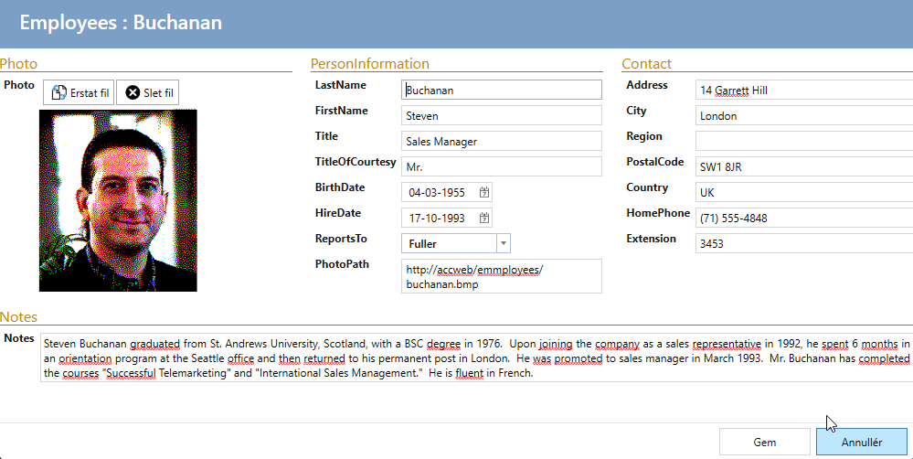

# Grouping of fields

By default, the fields in show/edit/insert-views are displayed as a long list.

With the UI designer, it can be easily customized so that fields are grouped and placed more logically.

And as an edit-view:

See how in the video.

<iframe width="560" height="315" src="https://www.youtube.com/embed/-IBD1lKUmGw?si=iMBbYwz_cX6kAFuh" title="YouTube video player" frameborder="0" allow="accelerometer; autoplay; clipboard-write; encrypted-media; gyroscope; picture-in-picture; web-share" allowfullscreen></iframe>