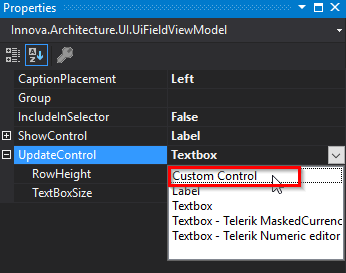
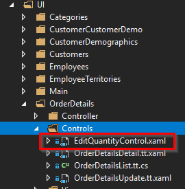

# "Custom control" on a field

In the UI IAD, find the field you want to attach a custom control to.


In the properties window in Visual Studio, for the selected field, choose the "Custom control" for either UpdateControl or ShowControl. Depending on whether you want the control type in editing or just in viewing.

 

Click "Create code" under the ribbon group "Code for selected"

Under Controls for OrderDetails, an EditQuantityControl.xaml will now be created.

 

```xml
<UserControl x:Class="NorthwindClient.UI.OrderDetails.Controls.EditQuantityControl"
             xmlns="http://schemas.microsoft.com/winfx/2006/xaml/presentation"
             xmlns:x="http://schemas.microsoft.com/winfx/2006/xaml"
             xmlns:mc="http://schemas.openxmlformats.org/markup-compatibility/2006" 
             xmlns:d="http://schemas.microsoft.com/expression/blend/2008" 
             mc:Ignorable="d" 
             d:DesignHeight="300" d:DesignWidth="300"
             x:Name="EditQuantityControlName">

            <TextBlock Text="{Binding Quantity}"/>
</UserControl>
```

The control's data context will be the entity, and you will be able to customize the control to contain the editor you want.

Example:

```xml
<UserControl x:Class="NorthwindClient.UI.OrderDetails.Controls.EditQuantityControl"
             xmlns="http://schemas.microsoft.com/winfx/2006/xaml/presentation"
             xmlns:x="http://schemas.microsoft.com/winfx/2006/xaml"
             xmlns:mc="http://schemas.openxmlformats.org/markup-compatibility/2006" 
             xmlns:d="http://schemas.microsoft.com/expression/blend/2008"
             xmlns:telerik="http://schemas.telerik.com/2008/xaml/presentation"
             mc:Ignorable="d" 
             d:DesignHeight="300" d:DesignWidth="300"
             x:Name="EditQuantityControlName">
    <telerik:RadNumericUpDown Value="{Binding Quantity, Mode=TwoWay}"
                              Minimum="1"
                              HorizontalAlignment="Stretch"
                              VerticalAlignment="Center"
                              MinWidth="113"
                              NumberDecimalDigits="0" />
</UserControl>
```
