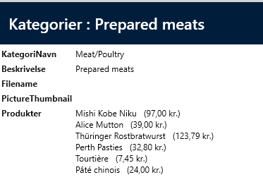
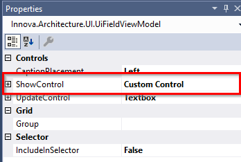

# Custom control relation

It is possible to create a custom control on a field that contains related data.
Example on Category, where you would like to display the list of products with some extra formatting, logic, etc.

As shown below
 

Here, the category's products are displayed in a list with product name and price.

This is done by 
1. Checking off products, as shown below.

 

2. Set ShowControl to "Custom Control", as shown below.

 

3. Generate code.

A new file has now been code-generated under "Categories\Controls\ShowProductsControl.xaml".
By default, it just contains a text block where the binding is set to the Products property on the Category entity.
This needs to be changed as we want to bind to a collection that is on the view model.

```xml
<UserControl x:Class="NorthwindClient.UI.Categories.Controls.ShowProductsControl"
             xmlns="http://schemas.microsoft.com/winfx/2006/xaml/presentation"
             xmlns:x="http://schemas.microsoft.com/winfx/2006/xaml"
             xmlns:mc="http://schemas.openxmlformats.org/markup-compatibility/2006" 
             xmlns:d="http://schemas.microsoft.com/expression/blend/2008" 
             mc:Ignorable="d" 
             d:DesignHeight="300" d:DesignWidth="300"
             xmlns:localControls="clr-namespace:NorthwindClient.UI.Categories.Controls"
             x:Name="ShowProductsControlName">
    <ItemsControl ItemsSource = "{Binding RelativeSource={RelativeSource FindAncestor,   AncestorType={x:Type localControls:CategoriesDetail}},Path=DataContext.ProductsItems.Items}">
        <ItemsControl.ItemTemplate>
            <DataTemplate>
                <StackPanel Orientation="Horizontal">
                    <TextBlock Text="{Binding ProductName}"/>
                    <TextBlock Text="{Binding UnitPrice, StringFormat={}   \({0:C}\)}"/>
                </StackPanel>
            </DataTemplate>
        </ItemsControl.ItemTemplate>
    </ItemsControl>
</UserControl>
```