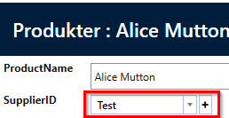

# Dropdown with add-new functionality

Sometimes there is a need to be able to add to the dropdown list immediately, without having to go to the Administration module to do this. This new control allows you to add directly from the input form via a new create button.

## Choose control type
In the designer, under User Interface, select the field you want to associate with the control. And the control is selected as illustrated in the following:

The following will show an example of the "Product" entity. Here, SupplierId will be associated with the new control type.

Here the new control is shown, which is a dropdown control with an associated "Create button"

