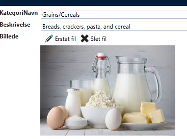

# 1 field (bytes)

If there is only one field (as in Category) varbinary(max) and nothing is configured on the controllers, then "Image - show" will display images and not display anything for other file types.

Here it is an image file
 

Here it is an Excel file, where nothing is displayed
 

For "Image - Editor", it is possible to upload at Insert or replace/delete at Update.

At Update:
 

At Insert:
 

When clicking on "Replace file" or "Add file", a file dialog appears from which you can choose a file.