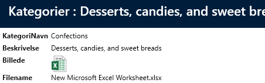
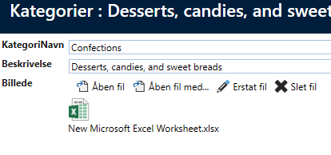
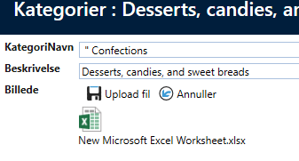

# 2 fields (bytes-and-filename)

If you want to support editing and re-uploading files, you need to add a field to the Category table. This field should contain the filename. In this case, we have extended the Category table with a "Filename" field.
Then, you need to configure the two "Image" controllers with the field that contains the "FileName".

In "User Interface", select the "Picture" field and in the property grid, you can now configure the "FileNameField" property on both controllers, as shown below.
 

In addition, we add the "Filename" field to show and list.

 

On Show, the icon for file types other than image file types will be displayed.
Example for Excel
 

For images:

 

## Edit files

When editing, there are now more options.

 

Open file - opens the file (in this case in Excel)
Open file with - Windows "Open with" opens and you can now choose which program to open the file with.
Replace file - upload a different file
Delete file - deletes the file

If you click on "Open file", the file opens in Excel and you can start editing the file.
When you are done editing the file, save the file and close Excel, so you return to editing.
Now the toolbar looks like this:
 

If you click on "Upload file", the file you just edited is uploaded.

Then click on "Save" for the entire window and the file is saved in the database itself.
Note that the "Filename" field is automatically updated when you upload a file.