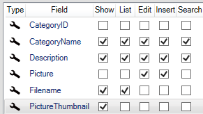

# 3 fields (bytes, filename, and thumbnail)

In some cases, you may want to save a thumbnail of an image and display it on the show page instead of the original image. This is typically where large images are uploaded and for performance reasons, you do not want to pull, for example, a 10mb image out of the database every time you go to a show page.

Here we add a field to the Category table "PictureThumbnail" varbinary(max).

The configuration will look like this.

 

The "Picture" field has been removed from the show and "PictureThumbnail" has been added to the show.

The configuration of the UpdateControl on "Picture" will look like this:

 

The field containing the thumbnail is configured. It is in the actual upload of a file that the "PictureThumbnail" field is updated with a Thumbnail.

If you want to support displaying icons in the "PictureThumbnail" field, you need to configure the control's "FilenameField" property:

 