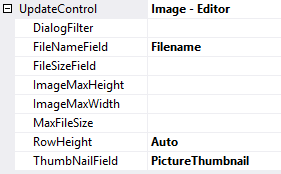
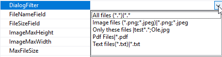

# Other Configurations

There are other configuration options for file upload:

 

**DialogFilter** - here you can choose a predefined filter or write one yourself. This filter is set on OpenFileDialog and thus you can limit which file types can be uploaded.
 

**FileSizeField** - If you want to save the file size in the database, you can create a field in the database and select the field here. The field will be automatically updated when uploading a file.

**ImageMaxHeight** - the maximum height of the image when it is displayed in the view.

**ImageMaxWidth** - the maximum width of the image when it is displayed in the view.

**MaxFileSize** - Here you can set a limit on how large the files may be. The value is in MB.