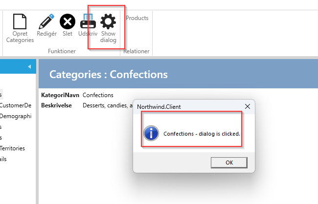

# Add Menu

**Requirement**: In the show-view for Categories, there should be a button in the menu, which should display a dialog box when the button is clicked

**Task**: Create a Menu and register it on the menuservice for CategoriesShow (CategoriesShowMenuService)

**Implementation**: 

1. Select "User Interface".
2. Select "Categories".
3. Select the Show tab.
4. Under "Code Tasks" select "MenuItem", enter a Name for the menu class and click on "Add Code". 
A file named CategoriesShowMenu.cs will now be generated, which can be customized as desired, as illustrated below.

```cs
 //TODO: Set the property "GroupName"" in the constructor and register the menu in the menuservice.
//To show the menu when the view is active, add this in the partial method 'Initialize' in the showmenuservice: 
//this.AddMenu<Menus.CategoriesShowDialogMenu>();

public class CategoriesShowDialogMenu:MenuModelEntity<Northwind.Data.Entity.CategoriesShow>
{
    private readonly IWindowDialogService _windowDialogService;

    public CategoriesShowDialogMenu(IEventAggregator eventAggregator, IWindowDialogService windowDialogService) :base(eventAggregator)
    {
        Header = "Show dialog";
        Description = "Click to show dialog";
        GroupName = MenuGroupNames.Functions; 
        SetImages(Innova.Prism.Library.Styles.WindowsMenuImages.gear);
        Command = new LogDelegateCommand(ExecuteCategoriesShowDialogMenu, CanExecuteCategoriesShowDialogMenu);
        _windowDialogService = windowDialogService;
    }

    private bool CanExecuteCategoriesShowDialogMenu()
    {
        return this.Entity != null;
    }
     
    private void ExecuteCategoriesShowDialogMenu()
    {
        _windowDialogService.ShowInformation($"{this.Entity.CategoryName} - dialog is clicked.");
    }
}
```

In the above, windowsDialogService is injected and is used in the executeCommand.

The show-view now looks like this

