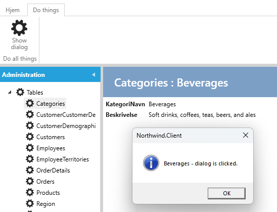

# MenuService

For each view, there is a menu service that determines how the toolbar should look in the view.

Tabs, groups, and buttons can be added via the service.

**Requirement**: In the show-view for Categories, there should be a tab "Do things", which contains a group "Do all things" with a button that displays a dialog.

**Task**: In CategoriesShowMenuService, add a tab, a group, and a menu button.

**Implementation**: 

1. Select "User Interface".
2. Select "Categories".
3. Select the Show tab.
4. Under "Code Tasks" select "MenuService" and click on "Add Code". 

A file named CategoriesShowMenuService.cs will now be generated, which can be customized as desired, as illustrated below.

```cs
    public partial class CategoriesShowMenuService
    {
        const string CategoryTabName = "CategoryTabName";
        const string CategoryGroupName = "CategoryGroupName";
        partial void Initialize()
        {
            this.AddTab(CategoryTabName, "Do things", 4);
            this.AddGroup(CategoryGroupName, "Do all things", CategoryTabName, 2);
            this.AddMenu<Menus.CategoriesShowDialogMenu>(CategoryGroupName, 1);
        }
    }
```

The show-view now looks like this:

