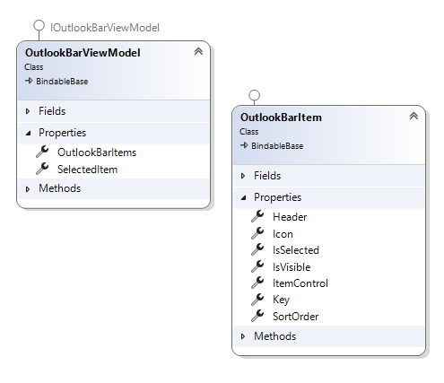
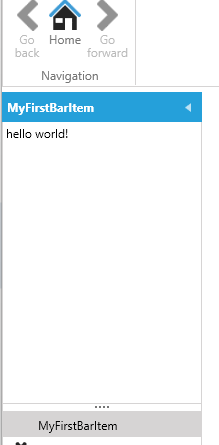
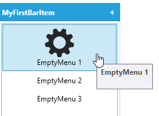
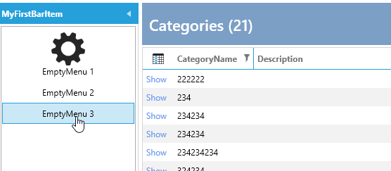
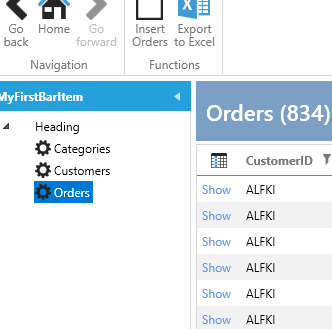

# OutlookBar

The OutlookBar is implemented in the `MainWindow` and is data-bound to an `OutlookBarViewModel`, which is injected into the `MainWindowViewModel`.

Here is a diagram of the `OutlookBarViewModel`:



The `OutlookBarViewModel` has a collection of `OutlookBarItem` elements, allowing you to add items to this collection.

Each `OutlookBarItem` has a property called `ItemControl`, which represents the `UserControl` that will be displayed within the item.

To add a simple `OutlookBarItem`, you can do this in the `MainWindowViewModel`:

```csharp
outlookBarViewModel.OutlookBarItems.Add(new OutlookBarItem()
{
    Header = "MyFirstBarItem",
    ItemControl = new MyOutLookBarView()
});
```

`MyOutLookBarView` is a basic `UserControl` with a `TextBlock`, which looks like this:



However, this approach is not very MVVM-friendly. To improve it, you can use the `OutlookBarService`.

## OutlookBar Service

In a module, you can override the `ConfigureOutlookBarService` method as follows:

```csharp
protected override void ConfigureOutlookBarService(IOutlookBarService outlookBarService)
{
    outlookBarService
        .AddOutlookBarItem(new OutlookBarItem() { Header = "MyFirstBarItem" })
        .WithView<MyOutLookBarView>();
}
```

Now, the view is activated by the `IServiceProvider`.

In most cases, your OutlookBar will display either a list of menus or a TreeView with menus.

### WithSimpleMenuView

To simplify this process, extensions and builders are available.

To create a simple list of menus, use this code:

```csharp
protected override void ConfigureOutlookBarService(IOutlookBarService outlookBarService)
{
    outlookBarService
        .AddOutlookBarItem(new OutlookBarItem() { Header = "MyFirstBarItem" })
        .WithSimpleMenuView()
            .AddMenuItem(new MenuItemViewModel() { Title = "EmptyMenu 1", ImageSource = ImageProvider.GetImage(Innova.Prism.Library.Styles.WindowsMenuImages.gear_Keyname)?.Source })
            .AddMenuItem(new MenuItemViewModel() { Title = "EmptyMenu 2" })
            .AddMenuItem(new MenuItemViewModel() { Title = "EmptyMenu 3" });
}
```

This code results in the following menu:



You can also turn both `OutlookBarItem` and `MenuItem` into classes activated by the `IServiceProvider`.

Here are the `OutlookBarItem` and `Menu3` classes. This allows you to inject dependencies, such as the `IEventAggregator`, into the constructor of `Menu3`:

```csharp
public class MyFirstBarItem : OutlookBarItem
{
    public MyFirstBarItem()
    {
        Header = "MyFirstBarItem";
        SortOrder = 1;
        Icon = ImageProvider.GetImage(Innova.Prism.Library.Styles.WindowsMenuImages.gear_Keyname)?.Source;
    }
}

public class EmptyMenu3 : MenuItemViewModel
{
    private readonly IEventAggregator _eventAggregator;

    public EmptyMenu3(IEventAggregator eventAggregator)
    {
        _eventAggregator = eventAggregator;
        Title = "EmptyMenu 3";
    }

    protected override void ExecuteCommand()
    {
        _eventAggregator.PublishListShowEvent<Data.Entity.Categories>();
    }
}
```

To use these classes, configure them like this:

```csharp
protected override void ConfigureOutlookBarService(IOutlookBarService outlookBarService)
{
    outlookBarService
        .AddOutlookBarItem<MyFirstBarItem>()
        .WithSimpleMenuView()
            .AddMenuItem(new MenuItemViewModel() { Title = "EmptyMenu 1", ImageSource = ImageProvider.GetImage(Innova.Prism.Library.Styles.WindowsMenuImages.gear_Keyname)?.Source })
            .AddMenuItem(new MenuItemViewModel() { Title = "EmptyMenu 2" })
            .AddMenuItem<EmptyMenu3>();
}
```

Now, when you click `Menu3`, the list of Categories is displayed:



In most cases, you want to show a list when a menu is clicked. There are extensions for this purpose:

```csharp
protected override void ConfigureOutlookBarService(IOutlookBarService outlookBarService)
{
    outlookBarService
        .AddOutlookBarItem<MyFirstBarItem>()
        .WithSimpleMenuView()
            .AddMenuWithShowList<Data.Entity.Customers>()
            .AddMenuWithShowList<Data.Entity.Orders>()
            .AddMenuWithShowList<Data.Entity.Categories>();
}
```

The result looks like this:


You can also present it as a `TreeView` to create a hierarchy of menu items.

### WithTreeMenuView

To create a hierarchical menu, use the following code:

```csharp
protected override void ConfigureOutlookBarService(IOutlookBarService outlookBarService)
{
    outlookBarService
        .AddOutlookBarItem<MyFirstBarItem>()
        .WithTreeMenuView()
        .AddMenuItem(new MenuItemViewModel() { Title = "Heading" },
            subbuilder => subbuilder
                .AddMenuWithShowList<Data.Entity.Customers>()
                .AddMenuWithShowList<Data.Entity.Orders>()
                .AddMenuWithShowList<Data.Entity.Categories>());
}
```

The resulting menu looks like this:



In this example, we changed `WithSimpleMenuView` to `WithTreeMenuView`, added an empty `MenuItem`, and then added three sub-menu items under that heading.
