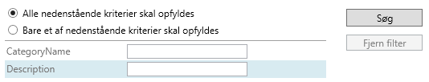
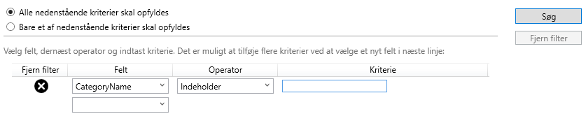
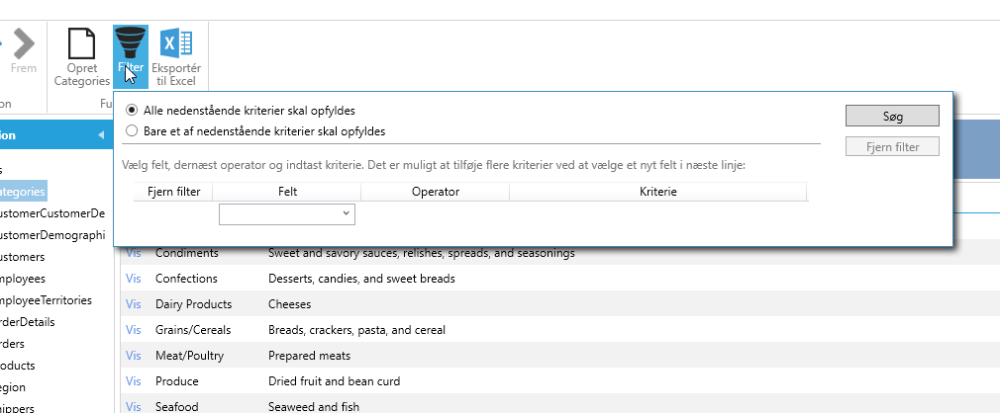
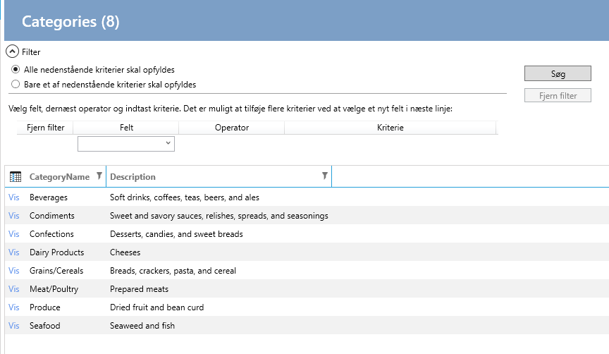
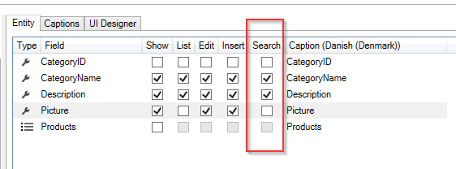

# Search

Two types of search screens can be created: Simple and Advanced.

**Simple**

**Advanced**

And the two screens can be displayed in two different ways: In the toolbar or above the list:

**Toolbar**

**Above the list**

In the designer, select "User interface" and the entity for which the search screen should be created.

Choose which fields should be searchable, as shown below.

Next, select the "Search" tab and in the Visual Studio property window, select the configuration for the search screen.

Then click on "Create code".