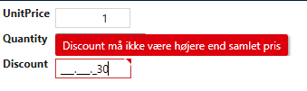

# Other Examples

```csharp
    public partial class OrderDetailsValidator
    {
        partial void AfterInitialize()
        {
            RuleSet(RuleSetNames.PropertyRuleSetName, () =>
            {
                //Create simple validation for a single field
                RuleFor(ent => ent.UnitPrice).GreaterThanOrEqualTo((decimal)1)
                    .WithName(nameof(OrderDetails));
                //Create complex validation for a field
                RuleFor(ent => ent.Discount).Must(ValidateDiscount)
                    .WithMessage("Discount must not be higher than total price")
                    .WithName(nameof(OrderDetails));
            });
        }

        private bool ValidateDiscount(IOrderDetails obj, float arg)
        {
            //The discount must not exceed the total price
            return (obj.Discount > 0) && (obj.UnitPrice * obj.Quantity) > (decimal)obj.Discount;
        }
    }
```

This will result in the validation being displayed in the UI as follows:

Simple validation on UnitPrice

 

Complex validation on Discount

 