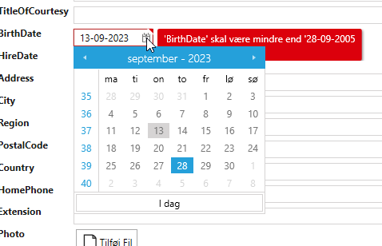

# Basic Validation

**Requirement**: Employees must be over 18 years old

**Task**: Create a validation rule on the property "BirthDay". "BirthDay" should be more than 18 years ago from today's date.

**Implementation**: 

1. Select "Validation"
2. Select "Employees"
3. In "Code Tasks" select "Validator" and click "Add Code". An EmployeesValidator.cs file will now be generated, which can be freely customized, as shown below.

In this case, the partial method "AfterInitialize" is implemented.

```cs
public partial class EmployeesValidator
{
    partial void AfterInitialize()
    {
        RuleSet(RuleSetNames.PropertyRuleSetName, () =>
        {
            RuleFor(ent => ent.BirthDate).LessThan(DateTime.Now.AddYears(-18));
        });
    }
}
```

In the UI, it looks like this if you enter an "incorrect" date.

