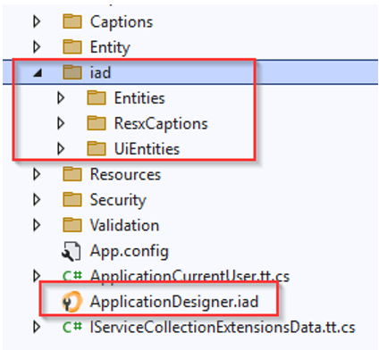
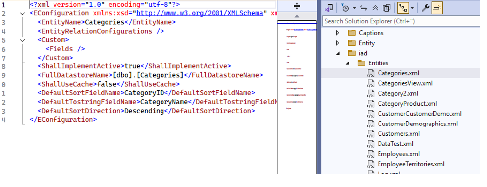
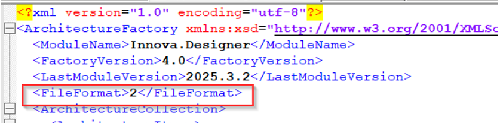

# Experimental Feature: Split Configuration Files for Improved Merge Workflow

This document describes a new experimental feature in the Innova Designer that allows developers to work with split configuration files instead of a single monolithic .iad file. This feature is designed to improve source control collaboration and reduce merge conflicts, especially in teams using branching strategies such as Git Feature Branches.

________________________________________
Background
Traditionally, the Designer has saved all project configuration into a single .iad XML file. While this is convenient for serialization, it becomes problematic in collaborative development workflows:
- Merge conflicts are frequent when multiple developers modify different parts of the architecture.
- Version control diffs are large and often unclear, even for small changes.
This new feature addresses the issue by allowing the .iad file to be split into smaller, focused XML files per item (e.g., one file per entity, one per UI screen, etc.), making changes easier to manage and resolve.

## How It Works (High-Level)
The Designer now supports three modes for saving project configuration, determined by the FileFormat property inside the .iad file:

FileFormat = 1 (Default / Monolithic Mode)
- This is the current and default behavior.
- All configuration is saved into a single .iad file.
- Recommended for single-developer environments or early-stage projects.
FileFormat = 2 (Split Mode)
- Configuration is split into separate files:
    - The main .iad file still exists.
    - Entity configuration are saved in iad/Entities/*.xml with a xml file per entity
    - UI configuration in iad/UiEntities/*.xml with a xml file per entity
    - Entity Captions configuration in iad/ResxCaptions/*.xml, grouped per entity and including all cultures, with a xml file per entity
- This significantly reduces the chance of merge conflicts, since changes are isolated.
- Great for teams using feature branch strategies or parallel development on different parts of the app.
 

FileFormat = 3 (Convert to Monolithic)
- Used to convert a split project back to a single .iad file.
- All existing split files will be deleted when saving.

## How to Use This Feature
Note: This feature is currently experimental and must be enabled manually by editing the .iad file directly.

1. Enable Split Saving
1.	Open your .iad file in a text editor.
2.	Locate or add the following XML tag:
3.	<FileFormat>2</FileFormat>
4.	Save the file.
5.	Next time you open and save the project in the Designer, it will split the configuration accordingly.
2. Revert to Monolithic Saving
1.	Set the tag to:
2.	<FileFormat>3</FileFormat>
3.	Save the project in the Designer — this will collapse all split files into a single .iad file and delete the others.

## Benefits for Source Control
- Easier code reviews: Diffs are isolated to relevant entities or UI components.
- Minimal merge conflicts: Two developers can modify different files without overlap.
- Faster conflict resolution: If a conflict does occur, it is scoped to a single file.
- leaner history: Git logs are more meaningful and focused.

## Limitations (For Now)
- This is an experimental feature and has no UI toggle yet.
- You must manually edit the .iad file to switch formats.
- Only Entities, UI Entities, and Captions are split right now. Other parts are still saved in the main .iad.

## Summary
This feature is especially useful for collaborative teams using Git or other version control systems where frequent merges and parallel work are common. By isolating changes to separate XML files, the Designer becomes significantly more merge-friendly.
We encourage teams to try it out and provide feedback, keeping in mind that it is currently in an experimental phase and evolving.

